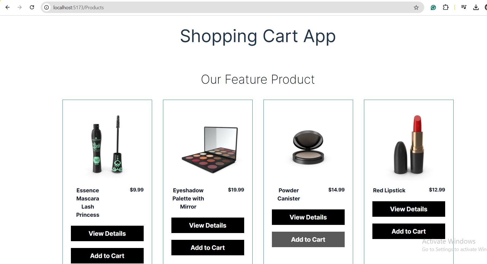
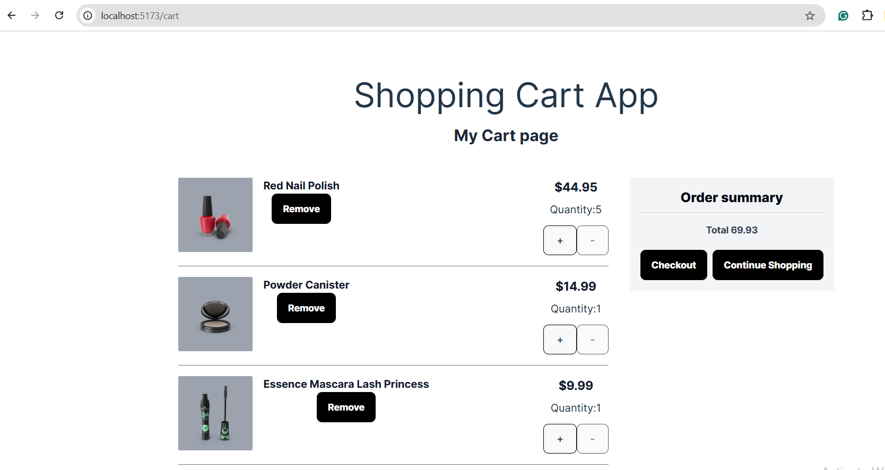
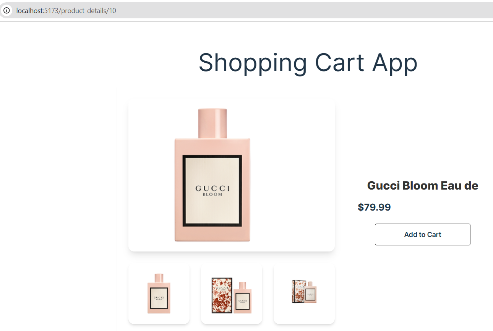

# React + Vite

This template provides a minimal setup to get React working in Vite with HMR and some ESLint rules.

Currently, two official plugins are available:

- [@vitejs/plugin-react](https://github.com/vitejs/vite-plugin-react/blob/main/packages/plugin-react/README.md) uses [Babel](https://babeljs.io/) for Fast Refresh
- [@vitejs/plugin-react-swc](https://github.com/vitejs/vite-plugin-react-swc) uses [SWC](https://swc.rs/) for Fast Refresh

# Shopping Cart Application
## Introduction
This project is a fully functional Shopping Cart Application built with React. It utilizes various React hooks and React Router for navigation, creating a seamless and dynamic user experience.

## Features
--> Add to Cart: Easily add items to your cart.
--> Remove from Cart: Remove unwanted items from the cart.
--> Quantity Management: Adjust the quantity of items in the cart.
--> Cart Summary: Display the total price and number of items.
--> Persistent State: Retain cart items between page reloads using local storage.
--> Page Navigation: Navigate between different pages using React Router.

## Technologies Used
React: Front-end library for building user interfaces.
React Hooks: useState, useEffect, useContext, and useReducer 
React Router: For navigating between different pages.
Twailwind

## Some SnapShot From Project

### Product page

### Add to cart page

### Product Detail page

